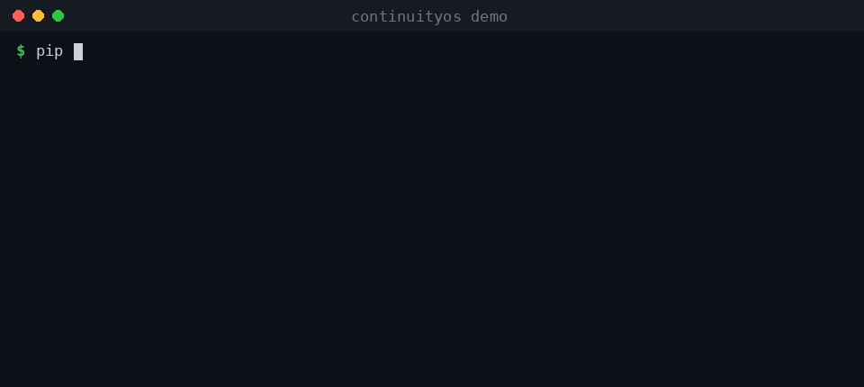

# ContinuityOS

[](https://pypi.org/project/continuityos/) [](https://pypi.org/project/continuityos/) [](LICENSE)


> ## 🛡️ ContinuityOS — AI Agent Governance Gateway
>
> **No dangerous tool runs unless ContinuityOS approves it.** A local-first, MCP-native
> hard-boundary that AI coding agents (Claude Code, Cursor, Codex CLI) must pass through:
> every risky shell/file/git action gets a preflight decision — `ALLOW · WARN · HOLD · DENY ·
> REQUIRE_CONFIRMATION · DRY_RUN_ONLY` — with reasons, an append-only tamper-evident audit
> ledger, and a rollback plan. Apache-2.0.
>
> ```bash
> continuity run shell -- rm -rf /     # ⛔ BLOCKED — command was NOT executed
> continuity run shell -- npm test     # ✓ ALLOW — runs
> ```
>
> ContinuityBench v0: **100% decision accuracy, 9/9 dangerous actions stopped** (vs 0/9 with no
> gateway). What makes it smarter than a static policy engine: it decides **with continuity
> context** (your canon/rules/state), not just regex. See [BUILD_GATE_STATUS.md](BUILD_GATE_STATUS.md).
>
> The memory + continuity layers below are the **context engine** that powers those decisions.

---



**Durable memory + continuity layer for AI agents and humans.** Local-first, zero external services, Apache-2.0.

Not just a vector store — ContinuityOS keeps the *thread* between sessions and between versions of you and the model: **memory** (hybrid recall) **+ continuity** (canon, frontiers, loops, checkpoints, anti-drift doctor, handoff) **+ a multi-agent council** (many agents + you on one memory, authority levels & roles) **+ a digital twin** (a behavioral model built from your own memory — the human↔AI co-evolution / dyad layer) **+ an operator control plane** (correct, redact, rollback, export).

Your Claude / ChatGPT / agent forgets everything between sessions. ContinuityOS is a small local memory layer that stores what matters — who you are, your projects, your rules, decisions you've made — and gives it back when it's relevant. It recalls **both structurally** (folder-like namespaces + keyword search) **and semantically** (vector similarity), so the right memory surfaces whether you match the words or just the meaning.

Nothing leaves your machine. One SQLite file. No cloud, no account, no telemetry.

---

## Why

- **Agents forget.** Every new session starts cold. ContinuityOS persists context across sessions and tools.
- **Hybrid recall.** Keyword-only memory misses paraphrases; pure-vector memory misses exact facts and structure. ContinuityOS blends both.
- **Structure like folders.** Memories live in namespaces — `identity`, `projects`, `rules`, `facts`, `events`, `notes` (or your own) — so recall can be scoped and a human can browse it.
- **For agents *and* humans.** Use it from your code, from the CLI, from an MCP-capable client (Claude Desktop / Claude Code), or over a tiny HTTP API.
- **Local-first & private.** Core is **stdlib-only** — no required dependencies, no services. Drop-in to anything.

---

## Install

```bash
pip install continuityos          # core (stdlib-only)
# optional, for production-grade embeddings:
pip install "continuityos[fast]"        # recommended: FastEmbed / ONNX
pip install "continuityos[st]"          # sentence-transformers
pip install "continuityos[m2v]"         # light static model2vec
pip install "continuityos[embeddings]"  # all optional embedders
```

Requires Python 3.10+.

---

## Quick start

### From the CLI

```bash
cos remember "Robert prefers Apache-2.0 licenses" -n rules -t license
cos remember "ContinuityOS = hybrid memory: FTS + vectors" -n projects
cos recall  "which license should I pick?"
# 0.54 [rules] Robert prefers Apache-2.0 licenses  (semantic 0.22 + keyword)
cos namespaces
```

### From Python

```python
from continuityos import Memory

m = Memory("memory.db")
m.remember("The grid lab K=0.04 cohort led at +$1405 / 3 days", namespace="facts", tags=["trading"])

for hit in m.recall("best grid setup", k=3):
    print(hit.score, hit.namespace, hit.text)

# inject straight into an agent prompt:
print(m.context("what do I know about grid trading?"))
```

### As an MCP server (Claude Desktop / Claude Code)

ContinuityOS ships an MCP stdio server so an agent can `remember` and `recall` on its own. Add to your MCP client config:

```json
{
  "mcpServers": {
    "continuityos": {
      "command": "cos",
      "args": ["--db", "~/.continuityos/memory.db", "serve"]
    }
  }
}
```

Tools exposed: `remember`, `recall`, `context`, `forget`, `list_namespaces`, `checkpoint`, `handoff`, `doctor`, `set_frontier`, `predict`, `alignment`, `preflight_action` — **12 tools**.
Now the agent pulls relevant memory automatically before answering — and writes new facts back as it learns it.

**Recommended:** use the cross-platform bridge instead of `cos serve`:

```json
{
  "mcpServers": {
    "continuityos": {
      "command": "python",
      "args": ["/path/to/mcp_bridge.py"]
    }
  }
}
```

See [docs/MCP_INTEGRATION.md](docs/MCP_INTEGRATION.md) for Hermes, Claude Desktop, and Cursor setup.

### Over HTTP (optional)

```bash
cos api --port 8077                       # local-only: 127.0.0.1
curl -s "localhost:8077/recall?q=license&k=3"
curl -s -XPOST localhost:8077/remember -d '{"text":"hello","namespace":"notes"}'
```

Remote bind is intentionally opt-in:

```bash
export CONTINUITYOS_ALLOW_REMOTE=1        # required for --host 0.0.0.0
export CONTINUITYOS_TOKEN='change-me'     # optional bearer auth for HTTP API
cos api --host 0.0.0.0 --port 8077
curl -H "Authorization: Bearer $CONTINUITYOS_TOKEN" "localhost:8077/health"
```

### Real semantic recall (recommended)

The default embedder is offline & dependency-free. For real semantic quality (synonyms, paraphrases), switch in one line:

```python
from continuityos import Memory
from continuityos.embedders import FastEmbedEmbedder   # pip install "continuityos[fast]"
m = Memory("memory.db", embedder=FastEmbedEmbedder())  # bge-small, ONNX, no torch
```

Benchmark (see [BENCHMARKS.md](BENCHMARKS.md)): `recall@5` 0.50 → **1.00**, MRR 0.38 → 0.58. Real LoCoMo harness ready in `bench/locomo_bench.py`.

### With Docker

```bash
docker compose up -d        # HTTP API on :8077, memory persisted in ./cos-data
```

---

## More than memory — the continuity layer

A chat is a terminal, not memory. ContinuityOS persists the operating state that keeps work coherent across sessions:

- **Canon** — slow, non-negotiable truths (who you are, rules you don't break).
- **Frontiers** — `1 trunk + 1 cash + 1 lab` focus discipline; classify every idea.
- **Open loops** — what's still unfinished, bounded so it can't sprawl.
- **Checkpoints** — every session ends with `delta + next irreversible action + proof`.
- **Doctor** — an anti-drift check: is a cash frontier set? loops bounded? checkpoint fresh? proof attached?
- **Handoff pack** — one block (canon + frontiers + loops + last checkpoint) to resume in a new session or hand to another agent.

```bash
cos frontier trunk continuityos
cos frontier cash  inner-circle
cos loop "ship v0.2 to GitHub"
cos checkpoint --summary "built continuity layer" --next "update sites" --proof continuity.py
cos doctor       # ✅ healthy 5/5  (or flags drift)
cos handoff      # paste this into the next session
```

```python
from continuityos import Continuity
c = Continuity(db="memory.db")
c.add_canon("Proof beats explanation. Closure beats branching.")
c.set_frontier("cash", "inner-circle")
c.checkpoint(summary="...", next_action="...", proof="path/to/artifact")
print(c.doctor())     # anti-drift report
print(c.handoff())    # resume-context block
```

Over MCP the agent gets `checkpoint`, `handoff`, `doctor`, `set_frontier` tools too — so it maintains its own continuity, not just its recall.

---

## How it works

```
            remember(text, namespace, tags)
                        │
                        ▼
        ┌───────────────────────────────┐
        │            Store               │   one local SQLite file
        │  items  +  FTS5  +  vectors    │
        └───────────────────────────────┘
                        ▲
          recall(query) │  HYBRID rank
            ┌───────────┴───────────┐
   structural / keyword       semantic / vector
   (FTS5 + namespace)         (cosine over embeddings)
            └───────────┬───────────┘
                  blended score → top-k
```

- **Structural layer** — `namespace` (folder-like) + `tags` + FTS5 full-text index.
- **Semantic layer** — each memory is embedded to an L2-normalized vector; recall ranks by cosine similarity.
- **Hybrid score** — `semantic_weight · semantic + (1 − semantic_weight) · keyword` (tunable; default 0.6).
- **Embeddings are pluggable** — the default `HashingEmbedder` is deterministic and fully offline (great for privacy and tests). For best semantic quality, pass any `str → list[float]` callable (e.g. a `sentence-transformers` model):

  ```python
  from sentence_transformers import SentenceTransformer
  enc = SentenceTransformer("all-MiniLM-L6-v2")
  m = Memory("memory.db", embedder=lambda t: enc.encode(t, normalize_embeddings=True).tolist())
  ```

---

## Privacy

ContinuityOS never sends your data anywhere. Memory is a single SQLite file on your disk. `.gitignore` is pre-configured to keep `*.db`, `data/`, and `takeout/` out of version control by construction.

---

## Standards & competitive position

The 2026 consensus is that **guardrails belong at the gateway, not embedded in application code** — a control point that intercepts every tool invocation, scores its risk, and approves or blocks before execution. ContinuityOS is exactly that control point, and maps onto the frameworks enterprises are now audited against:

- **OWASP LLM Top 10** — preflight classifies and gates the agentic risks directly: prompt-injection-driven destructive commands, tool poisoning (D3 schema/forbidden-pattern checks), excessive agency (SAP capability passports), and missing audit (append-only ledger).
- **NIST AI RMF / EU AI Act (high-risk obligations, in force Aug 2026)** — the tamper-evident decision ledger + rollback plan provide the *record-level traceability* and *human-oversight* hooks these frameworks require. Every decision is logged with reasons, severity, and a restore command.
- **MCP-native** — runs as an MCP server; the same preflight governs MCP tool calls, the layer competitors (Cisco AI Defense, Lasso) now target.

**What no one else has.** The crowded 2026 field (Galileo Agent Control, Maxim Bifrost, Palo Alto Prisma AIRS, Lasso, Defend AI) enforces *generic* policy — regex, ML classifiers, org rules. ContinuityOS decides **with your continuity context**: the same engine that remembers *your* canon and non-negotiable rules uses them to judge each action (`_canon_check`). That makes it the only gateway whose verdicts are personalized to the operator, not just the org. Plus two things detection-only tools skip: an **instant local rollback module** (snapshot → `continuity rollback <id>`) and **sovereign-local execution** (zero data leaves the disk — no SaaS egress, which is itself the top enterprise blocker: only 14.4% of agents reached production with full security sign-off in 2026).

Honest scope: rollback covers local files only; it cannot undo irreversible external side effects (network, prod, third-party APIs). The gateway raises the floor — it is not a guarantee.

## Two-tier memory & cost-aware routing

The strongest 2026 agents don't win on a bigger context window — they win on *how they handle the finiteness of context*. ContinuityOS implements the two-tier pattern Anthropic and OpenAI both converge on:

- **Session memory** — the auto-compactible state of the current run (goal, live hypotheses, found IDs, tool outcomes, unresolved blockers). Carried forward instead of re-derived each turn.
- **Long-term memory** — durable lessons, stable user preferences, recurring patterns, anti-patterns, domain facts. **One lesson per file; update the existing note, don't spawn duplicates** — the same discipline this repo's memory files follow.

`context(query, k, max_tokens=…, compact=…)` packs the most relevant long-term memories until a token budget is hit, so recall stays cheap, and its output order is deterministic — which matters for **prompt-cache stability**.

**Cache-friendly memory rules** (preserve the prompt-cache hash; cache miss = paying full price every turn):

1. Never put volatile values (`datetime.now()`, random IDs, per-turn counters) in the system prompt or any cached prefix — they reset the cache every call. Put them in the body of the last user message.
2. Keep tool definitions and the memory block in a **stable, sorted order** so the cached prefix is byte-identical across turns (`compact=True` + deterministic packing does this).
3. The cache threshold on Opus-4.8 is ~1024 tokens — keep the cached prefix above it to actually benefit.
4. To change instructions mid-run without busting the cache, inject a `role:"system"` message *into the history* rather than editing the cached system prompt.

**Cost-aware routing.** `estimate_cost(text, model_id, output_tokens)` prices a context block against a built-in `MODEL_REGISTRY` (Fable 5, Mythos 5, Opus 4.8, Haiku 4.5, GPT-5.5, Gemini 3.1 Pro / 3.5 Flash, Grok 4.3, DeepSeek V4 Pro — mid-2026 pricing). Same block costs ~28× more on Fable 5 than DeepSeek V4 Pro, so callers can route *commodity → interactive → high-stakes* tiers instead of always paying frontier price for trivial work.

## Why continuity, not just memory

**Models are the consumable. Continuity is the asset.** Every model upgrade (or vendor switch) normally resets your agent — it forgets your rules, your context, your decision history. ContinuityOS stores the agent *outside* the model: one SQLite file (canon + rules + bi-temporal facts + decision checkpoints + a behavioral twin). Swap the model underneath and `cos boot` brings back the *same* agent. Model-agnostic by design — vendor memory locks you to their model; this doesn't.

## Sim-OS — closed-loop simulation on top of the memory core

Beyond memory, ContinuityOS ships an experimentation layer: [`continuityos/sim/`](continuityos/sim/) is a durable OODA loop that lets an agent propose hypotheses, run them in an isolated simulation engine (Pandora), and crystallize only *verified* results into canon — with a risk-scoring governance gate, a hallucination-loop detector, and autonomous rollback. The point is epistemic safety: the agent can experiment and fail freely, but canon never gets poisoned.

```bash
cos sim --objective edge --iters 6      # run the closed loop (mock engine)
```

See [continuityos/sim/README.md](continuityos/sim/README.md) for the architecture.

## Honest limits (threat model)

We'd rather tell you the edges than oversell. Full detail in [THREAT_MODEL.md](THREAT_MODEL.md).

- **The gateway is not magic.** It stops known-dangerous shell/file/git *commands* (rm -rf, force-push, secret reads, curl|sh). It does **not** understand arbitrary application logic — a subtle bug inside a script it's allowed to run is out of scope. `exec` mode is argv-only and refuses shell operators; `shell` mode runs them but is classified more strictly.
- **Rollback is local-only.** It reverts local file/DB state. It **cannot** undo irreversible external side effects (a bad API call to prod, a deleted GitHub repo, a sent transaction). Gate those actions upstream; don't rely on rollback.
- **Default embedder is weak on purpose.** The zero-dependency `HashingEmbedder` is fast but semantically shallow. For real synonym/paraphrase recall install `continuityos[fast]` (ONNX, ~bge-small) or `[m2v]` (30MB static). We publish honest LoCoMo *retrieval* numbers in `BENCHMARKS.md` — not answer-graded marketing figures.
- **Memory can go stale.** A fact true last week can be wrong today. Use bi-temporal `supersede()` / `recall(current_only=True)` so corrections hide stale facts instead of contradicting them. Don't hand an agent raw memory without the current-only filter for state-sensitive decisions.
- **It asks for discipline.** Continuity relies on session-close rituals (`cos checkpoint`) and periodic `cos doctor`. Skip them and the store drifts toward a log dump. This is a feature (auditable thread), but it is real operator work.
- **Prompt-cache hygiene.** If you inject memory into a system prompt, keep it deterministic — a dynamic value (e.g. `datetime.now()`) busts the cache and you pay full context cost every call. `context(..., compact=True)` returns cache-stable output; don't wrap it in per-call timestamps.

Best fit today: **operators and teams that need auditable, governed continuity** (regulated internal ops, on-call/shift handoff, coding agents with rollback). Overkill if you just want Git-style backups and paste context by hand.

## Status

`v0.8.2` — **6 layers, 12 MCP tools, 37/37 tests, full audit passed.** Unified core, all tested (FastEmbed-accelerated recall, session rituals `boot/close/compress`, recall benchmark in `bench/`): **L1 Memory** (hybrid FTS+vector, WAL + thread-safe store) · **L2 Continuity** (canon/frontiers/loops/checkpoints/doctor/handoff) · **L3 Council** (multi-agent, authority levels + roles) · **L4 Twin** (digital twin: profile/predict/alignment — now in CLI too) · **L5 Control Plane** (correct/redact/rollback/export) · **L6 Autopoiesis** (self-maintenance doctor). CLI (`cos` + `continuity`), MCP server (**12 tools**, cross-platform `mcp_bridge.py`), HTTP API, Docker. CI via GitHub Actions.

**Audit fixes applied:** FastEmbed default + auto-fallback · Gate enforcement via Hermes shell hooks · predict/alignment in CLI · docs/ + quickstart example.

Roadmap: incremental vector index for large stores, optional reranking, import adapters (chat exports, notes), web memory browser.

## License

Apache-2.0. See [LICENSE](LICENSE).
