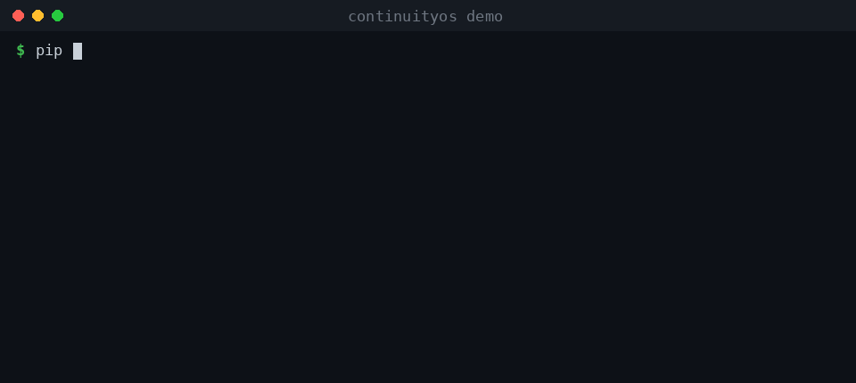

# ContinuityOS

[](https://github.com/bitmaster162/continuityos/actions/workflows/ci.yml) [](https://pypi.org/project/continuityos/) [](https://pypi.org/project/continuityos/) [](LICENSE)

**Durable memory + continuity for AI agents and humans. Local-first, offline by default, Apache-2.0.**

ContinuityOS keeps the state that should survive a chat, model, client, or process boundary: memory, canon, frontiers, open loops, checkpoints, and handoff context.

> Close one AI session or model. Later open another session or client. Recover durable state and continue without manually reconstructing context.

The core memory path requires no external service and no account. Governance, audit, controlled execution, and operational-memory tooling are available as advanced layers, but they are not required to get continuity working.

---

## Start here

### 1. Install

```bash
pip install continuityos
```

Requires Python 3.10+. The core package is stdlib-only. The default `HashingEmbedder` is deterministic, local, and does not initialize or download an optional model.

For an exact install of the current release:

```bash
pip install continuityos==0.10.3
```

### 2. Run the canonical onboarding

```bash
cos setup
cos import <export-path> --extract
cos status
cos connect <client>
cos demo continuity
cos boot
```

That sequence is the primary product path:

1. **`cos setup`** — guided local onboarding and memory setup.
2. **`cos import <export-path> --extract`** — import supported AI history and distill typed salient facts.
3. **`cos status`** — inspect product health and continuity state without mutating the memory store or client configuration.
4. **`cos connect <client>`** — connect ContinuityOS to an MCP-capable client. Managed clients support preview, explicit write, status, and rollback flows.
5. **`cos demo continuity`** — prove persistence across a fresh process using an isolated temporary database; it does not read or write the user's normal memory DB.
6. **`cos boot`** — reconstruct the local handoff and doctor report for the next session. Boot is offline by default; `--check-updates` explicitly opts into a PyPI update check.

Supported `connect` client names are `claude`, `cursor`, `hermes`, and `generic-mcp`.

Before changing a managed client config, preview it:

```bash
cos connect --status
cos connect claude --dry-run
cos connect claude --yes
```

For a machine-readable product snapshot:

```bash
cos status --json
cos demo continuity --json
```

### What the continuity demo proves

`cos demo continuity` creates known state in an ephemeral database, closes the writer, opens that database from a separate Python process, and verifies that canon, frontiers, an open loop, a checkpoint, the next action, and a keyed fact can be recovered. The temporary directory is removed before the command returns.

It proves a bounded persistence property. It does **not** prove that a different model is behaviorally identical to the previous model, and it does not claim a production security boundary.



---

## Why

- **Agents forget.** New sessions start cold; ContinuityOS persists state across sessions and tools.
- **Continuity is more than chat history.** Canon, frontiers, loops, checkpoints, doctor state, and handoff context make resumption explicit.
- **Hybrid recall.** Structural/keyword retrieval and semantic/vector retrieval can be combined.
- **Local-first.** Core memory is a local SQLite database with no required cloud service.
- **Portable.** Use the CLI, Python API, MCP, or the optional local HTTP API.
- **Inspectable.** The project favors explicit receipts, bounded claims, and documented failure modes over hidden automation.

The repository also contains experimental primitives: an authority-tagged multi-agent wrapper, a retrieval/keyword-based `Twin`, simulation helpers, and an operator control plane. Those experiments are not evidence of a validated behavioral twin, co-evolution outcome, or production multi-agent product.

The core does not upload user memory content. Governance and metering can create additional local databases. Explicit update checks and optional model downloads can make outbound requests; there is no account requirement or product telemetry.

---

## Import your AI history

ContinuityOS supports exports from **ChatGPT, Claude, Gemini, Grok, Mistral, and Perplexity**. Imported timestamps are kept bi-temporally so `cos recall --as-of <date>` can reconstruct what was known at a point in time instead of flattening everything into one present-tense dump.

```bash
cos import ~/Downloads/chatgpt-export/conversations.json
cos import ~/Downloads/claude-export/
cos import ~/Downloads/Takeout/
cos import grok-export.json
cos import perplexity_thread.json
cos import export.json --extract
```

Source auto-detection is available, and `--dry-run` reports an import without writing it:

```bash
cos import export.json --dry-run
```

Cross-vendor dedup uses the PAM `content_hash` standard. Import is deterministic and does not require vendor API keys.

---

## Core memory from the CLI

```bash
cos remember "Prefer Apache-2.0 for this project" -n rules -t license
cos remember "ContinuityOS uses durable local memory" -n projects
cos recall "which license should I pick?"
cos namespaces
```

Exact semantic-key lookup is also available:

```bash
cos remember "Current release is 0.10.3" -n facts -K current-release
cos find facts current-release
```

The packaged `cos` surface is offline-first for ordinary shared-memory commands. Optional FastEmbed construction happens only when explicitly requested:

```bash
# install optional FastEmbed support
pip install "continuityos[fast]"

# explicitly opt in for a command/session
export CONTINUITYOS_EMBEDDER=fast
```

On PowerShell:

```powershell
$env:CONTINUITYOS_EMBEDDER = "fast"
```

---

## From Python

```python
from continuityos import Memory

m = Memory("memory.db")
m.remember("A durable fact", namespace="facts")

for hit in m.recall("durable", k=3):
    print(hit.score, hit.namespace, hit.text)

print(m.context("what should I know before continuing?"))
```

For stronger semantic recall, pass an optional embedder explicitly:

```python
from continuityos import Memory
from continuityos.embedders import FastEmbedEmbedder

m = Memory("memory.db", embedder=FastEmbedEmbedder())
```

Install that optional path with:

```bash
pip install "continuityos[fast]"
```

Other optional extras are available for `sentence-transformers`, `model2vec`, or all supported embedders:

```bash
pip install "continuityos[st]"
pip install "continuityos[m2v]"
pip install "continuityos[embeddings]"
```

The optional embedder path is available, but no current comparative result artifact is shipped. See [BENCHMARKS.md](BENCHMARKS.md) for the reproducible zero-dependency floor and its limitations.

---

## MCP clients

`cos connect` is the product onboarding surface for MCP-capable clients. It can inspect all supported clients, preview managed config changes, apply managed changes only with confirmation/`--yes`, and roll back a recorded managed change if the config has not drifted.

```bash
cos connect --status
cos connect cursor --dry-run
cos connect cursor --yes
cos connect cursor --rollback
```

For manual configuration, ContinuityOS also ships an MCP stdio server. Tools are reported by the MCP `tools/list` response; use that response as the version-correct inventory.

```json
{
  "mcpServers": {
    "continuityos": {
      "command": "cos",
      "args": ["--db", "~/.continuityos/memory.db", "serve"]
    }
  }
}
```

The repository also includes a cross-platform bridge option:

```json
{
  "mcpServers": {
    "continuityos": {
      "command": "python",
      "args": ["/path/to/mcp_bridge.py"]
    }
  }
}
```

See [docs/MCP_INTEGRATION.md](docs/MCP_INTEGRATION.md) for Hermes, Claude Desktop, and Cursor integration details.

---

## Local HTTP API (optional)

```bash
cos api --port 8077
curl -s "localhost:8077/recall?q=license&k=3"
curl -s -XPOST localhost:8077/remember -d '{"text":"hello","namespace":"notes"}'
```

The default bind is local-only (`127.0.0.1`). Remote bind is intentionally opt-in:

```bash
export CONTINUITYOS_ALLOW_REMOTE=1
export CONTINUITYOS_TOKEN='change-me'
cos api --host 0.0.0.0 --port 8077
curl -H "Authorization: Bearer $CONTINUITYOS_TOKEN" "localhost:8077/health"
```

---

## Docker

```bash
docker compose up -d
```

The compose path exposes the HTTP API on port `8077` and persists memory in `./cos-data`.

---

## More than memory — the continuity layer

A chat is a terminal, not memory. ContinuityOS persists the operating state that keeps work coherent across sessions:

- **Canon** — slow, non-negotiable truths.
- **Frontiers** — `1 trunk + 1 cash + 1 lab` focus discipline.
- **Open loops** — unfinished work, bounded so it cannot sprawl indefinitely.
- **Checkpoints** — session-close state with summary, next action, and proof.
- **Doctor** — anti-drift checks over the continuity state.
- **Handoff** — a compact continuity block for the next session or agent.

```bash
cos frontier trunk continuityos
cos frontier cash inner-circle
cos loop "ship the next bounded product increment"
cos checkpoint --summary "completed bounded work" --next "verify the next gate" --proof receipt.json
cos doctor
cos handoff
```

```python
from continuityos import Continuity

c = Continuity(db="memory.db")
c.add_canon("Proof beats explanation. Closure beats branching.")
c.set_frontier("cash", "inner-circle")
c.checkpoint(summary="...", next_action="...", proof="path/to/artifact")
print(c.doctor())
print(c.handoff())
```

Over MCP the agent can receive continuity tools as well as recall tools, so continuity can survive beyond one prompt or one process.

---

## Governance — devil's advocate, audit, controlled runner

ContinuityOS also contains a governance and audit layer. Calls explicitly routed through `continuity run` or a correctly installed host hook can receive a decision — `ALLOW`, `WARN`, `HOLD`, `DENY`, `REQUIRE_CONFIRMATION`, or `DRY_RUN_ONLY` — with reasons, a local hash-chained ledger, and a local rollback plan where the controlled runner can materialize one.

ContinuityOS does **not** intercept raw shell, MCP, SDK, or tool calls merely because the package is installed. Mandatory broker enforcement remains future work.

```bash
continuity run shell -- rm -rf /     # blocked by the controlled path
continuity run shell -- npm test     # allowed by the controlled path when policy permits
```

ContinuityBench v0 is a **30-case, hand-labeled regression corpus**, not a security-boundary certification. The current verified run is summarized in [BUILD_GATE_STATUS.md](BUILD_GATE_STATUS.md), and CI fails if the corpus regresses. The bundled MCP adapter supplies its local continuity context; third-party adapters must explicitly provide and validate their own context.

Useful governance commands include:

- **`cos advocate "<claim>"`** — challenge a claim/action against memory and canon for contradictions, stale facts, missing evidence, canon conflicts, overconfidence, dishonest omissions, and irreversible actions.
- **`cos audit [--devil]`** — inspect memory invariants and emit audit-oriented records.
- **Governance preflight** — evaluate actions that are explicitly routed through a controlled surface.

```bash
cos advocate "This action is guaranteed to succeed"
cos audit --devil
```

---

## How memory works

```text
            remember(text, namespace, tags)
                        │
                        ▼
        ┌───────────────────────────────┐
        │            Store             │   one local SQLite file
        │  items  +  FTS5  +  vectors │
        └───────────────────────────────┘
                        ▲
          recall(query) │  HYBRID rank
            ┌───────────┴───────────┐
   structural / keyword       semantic / vector
   (FTS5 + namespace)         (cosine over embeddings)
            └───────────┬───────────┘
                  blended score → top-k
```

- **Structural layer** — namespace + tags + FTS5 full-text index.
- **Semantic layer** — vector similarity over the configured embedder.
- **Hybrid score** — blends semantic and keyword signals.
- **Pluggable embeddings** — the deterministic zero-dependency embedder is the default; stronger optional providers can be passed explicitly.

---

## Privacy

ContinuityOS core does not upload memory content. Memory is a local SQLite file; governance and metering can create additional local databases. `.gitignore` excludes common SQLite artifacts and downloaded benchmark data, but operators remain responsible for excluding their own import/export directories and secrets.

Update checks and optional model downloads are separate, explicit network-capable paths. `cos boot` stays local unless `--check-updates` is supplied.

---

## Governance boundary status

ContinuityOS currently provides a deterministic decision engine, an argv-only controlled CLI runner, and opt-in host hooks. These are useful enforcement points **inside the paths that are actually wired to them**. The MCP `preflight_action` tool is advisory: exposing it does not force an agent's other tools through it. Raw shell access, a direct SDK call, or an unconfigured host can bypass the gate entirely.

The ledger is append-only and hash-chained, with transactional concurrent appends, but it is not cryptographically signed or externally anchored. Local rollback is materialized by the controlled CLI immediately before approved execution for supported explicit file targets; advisory preflight responses do not claim that a snapshot already exists. These artifacts can support an audit, but they are not by themselves evidence of regulatory compliance. See [THREAT_MODEL.md](THREAT_MODEL.md) and [BUILD_GATE_STATUS.md](BUILD_GATE_STATUS.md).

---

## Two-tier memory and cost-aware routing

ContinuityOS supports a two-tier operating pattern:

- **Session memory** — compact current-run state: goal, live hypotheses, found IDs, tool outcomes, unresolved blockers.
- **Long-term memory** — durable lessons, stable preferences, recurring patterns, anti-patterns, and domain facts.

`context(query, k, max_tokens=…, compact=…)` packs relevant durable memories under a token budget. Deterministic ordering also helps prompt-cache stability.

Cache-friendly memory rules:

1. Avoid volatile values in a cached system-prompt prefix.
2. Keep tool definitions and memory blocks in stable, sorted order.
3. Provider cache thresholds and behavior change; verify current provider documentation before relying on them.
4. Prefer adding changed instructions later in the conversation rather than mutating a large stable prefix when cache stability matters.

`estimate_cost(text, model_id, output_tokens)` can compare a context block against the package's static `MODEL_REGISTRY`. Those registry entries are estimates, not a live price feed; verify current provider pricing before a financial or routing decision.

---

## Why continuity, not just memory

ContinuityOS stores continuity state outside a model: canon, rules, bi-temporal facts, and decision checkpoints can be reloaded after a model or vendor change. `cos boot` reconstructs a context pack; it does **not** prove that the new model is the same agent or will reproduce prior behavior.

---

## Sim-OS — experimental closed-loop simulation

Beyond memory, ContinuityOS ships an experimental layer in [`continuityos/sim/`](continuityos/sim/): a durable OODA-style loop with a mock simulation engine, risk scoring, loop detection, and local rollback hooks. It is designed to keep unverified results out of canon, but is not a sandbox or a guarantee against canon contamination.

```bash
cos sim --objective edge --iters 6
```

See [continuityos/sim/README.md](continuityos/sim/README.md) for the architecture.

---

## Extension seams

ContinuityOS is a memory + governance library, not a closed product. The [`Memory`](continuityos/memory.py) API, advisory governance preflight, and [`sim/`](continuityos/sim/) package are available extension seams. The in-repository Sim-OS/Pandora code is an experimental integration; no independent-user, retention, or production-dependency claim is made here without a linked receipt.

---

## Honest limits

Full detail is in [THREAT_MODEL.md](THREAT_MODEL.md).

- **Installation is not interception.** Only the controlled runner and correctly installed hooks enforce a result. MCP preflight is advisory, and direct/raw tools remain outside this boundary.
- **The classifier is not an oracle.** It covers known shell/file/git patterns and typed paths where supplied; it does not understand arbitrary application logic or close every TOCTOU gap.
- **Rollback is narrow and local-only.** The executor can snapshot supported explicit local file targets. Directories, symlinks, remote APIs, GitHub operations, messages, and remote transactions are not generally reversible through this module.
- **The ledger is tamper-evident, not tamper-proof.** Concurrent appends are serialized, but there is no signature, separate writer identity, or external anchor by default.
- **Default embeddings are intentionally lightweight.** `HashingEmbedder` is dependency-free and deterministic but semantically shallow. Install an optional embedder for stronger synonym/paraphrase recall.
- **Memory can go stale.** Use bi-temporal supersession/current-only retrieval for state-sensitive facts.
- **Continuity requires discipline.** Skip checkpoints and doctor checks and the store can drift toward an unstructured log.
- **Prompt-cache hygiene matters.** Dynamic values inside stable prefixes can defeat provider prompt caching.

Best fit today: **operators and teams that need durable, auditable continuity across sessions and tools**. It is overkill if all you need is a backup file and manual copy/paste context.

---

## Common Operational Memory v1 (shadow-only)

ContinuityOS includes a separate evidence-bound operational ledger. It does not replace Control Center current truth and cannot apply state changes:

```bash
continuity-memory init
continuity-memory import-broker MASTER_RETURN_REGISTRY_R64.jsonl
continuity-memory snapshot --out operational_snapshot.json
continuity-memory checkpoint --label after-import
continuity-memory verify
```

It stores schema-enforced append-only events, bi-temporal claims, authority-bound decisions, physical broker custody, and replay checkpoints in a **local SQLite WAL database outside DriveFS**. Imported returns are forced to `content_status=UNREVIEWED` and `apply_status=NOT_APPLIED`. See [`docs/COMMON_OPERATIONAL_MEMORY_V1.md`](docs/COMMON_OPERATIONAL_MEMORY_V1.md).

For evidence-bound project memory, the operator workflow separates verified current-session read-only surfaces from effectful gates:

```text
Existing project DB:
  continuity-work
    -> continuity-memory-delta             # NOT_APPLIED proposal
    -> continuity-memory-apply             # separate exact authorization

Fresh project DB:
  continuity-memory-bootstrap-plan         # NOT_APPLIED manifest proposal
    -> continuity-memory-bootstrap-check   # point-in-time READ_ONLY validation
    -> continuity-memory-bootstrap         # separate exact authorization
```

`continuity-work`, `continuity-memory-delta`, `continuity-memory-bootstrap-plan`, and `continuity-memory-bootstrap-check` never grant execution merely by returning READY/PASS. Effectful apply/bootstrap commands revalidate their exact inputs. None of these commands, by itself, applies accepted Control Center truth, deploys, dispatches an agent, trades, accesses a wallet, or grants capital permission.

---

## Advanced GitHub operator gates

These surfaces are for evidence-bound repository operations and are separate from ordinary product onboarding.

### GitHub Transition Gate v1

Verify a strict host-closure/GitHub-transport return without applying it:

```bash
continuity github-transition verify \
  --zip RETURN.zip \
  --sidecar RETURN.zip.sha256 \
  --ready RETURN.zip.READY_FOR_SYNC.json \
  --task-body-sha256 <controller-pinned-sha256>
```

The gate preserves exact producer terminals (including `REVISE`), verifies expected CODEX/WORK slots, repository visibility and remote HEAD/tree readbacks, and rejects force-push, existing-default merge, secret/raw-evidence leakage, and state/deployment/trading effects.

After semantic verdicts are recorded, evaluate a proposal-only memory candidate:

```bash
continuity memory-promotion evaluate \
  --closure-receipt GITHUB_TRANSITION_RECEIPT.json \
  --semantic-decisions SEMANTIC_DECISIONS.json
```

Even a successful result is only an eligibility/proposal result; live current state is not changed by that evaluation. See `docs/GITHUB_TRANSITION_GATE_V1.md`.

### GitHub Work Admission Gate v1

Before persistent code work, bind exact task bytes, session capsule, Git baseline, candidate branch, workspace, path scope, validation commands, and effect ceiling:

```bash
continuity work-admission verify \
  --request WORK_ADMISSION_REQUEST.json \
  --work-order WORK_ORDER.md \
  --session-capsule SESSION_CAPSULE.json \
  --repo /path/to/disposable/clone \
  --check-remote
```

After a candidate commit, execute the exact admitted validation vectors and bind the raw output:

```bash
continuity work-admission run-validation \
  --admission-receipt WORK_ADMISSION_RECEIPT.json \
  --admission-receipt-sha256 <SHA256> \
  --repo /path/to/candidate \
  --output-dir /outside/repo/validation-evidence

continuity work-admission verify-validation \
  --admission-receipt WORK_ADMISSION_RECEIPT.json \
  --admission-receipt-sha256 <SHA256> \
  --repo /path/to/candidate \
  --evidence-dir /outside/repo/validation-evidence
```

Then verify ancestry, changed paths, budgets, receipt binding, and independently rehashed evidence:

```bash
continuity work-admission verify-delta \
  --admission-receipt WORK_ADMISSION_RECEIPT.json \
  --admission-receipt-sha256 <SHA256> \
  --validation-receipt /outside/repo/validation-evidence/WORK_VALIDATION_RECEIPT.json \
  --validation-evidence-dir /outside/repo/validation-evidence \
  --repo /path/to/candidate \
  --check-remote
```

A pass authorizes only the later action explicitly granted by the operator. These gates do not implicitly create a branch, push, merge, deploy, apply current state, trade, or use capital. See `docs/GITHUB_WORK_ADMISSION_GATE_V1.md` and `docs/GITHUB_WORK_VALIDATION_EVIDENCE_V1.md`.

### GitHub Work Ledger v1

Persist one admitted GitHub work run as an immutable receipt chain:

```bash
continuity work-ledger init --admission-receipt ADMISSION.json --out work-00.jsonl
continuity work-ledger append-delta --ledger work-00.jsonl --delta-receipt DELTA.json --out work-01.jsonl
continuity work-ledger append-transport --ledger work-01.jsonl --transport-receipt TRANSPORT.json --out work-02.jsonl
continuity work-ledger append-semantic --ledger work-02.jsonl --semantic-decision GPT_DECISION.json --out work-03.jsonl
continuity work-ledger finalize --ledger work-03.jsonl --out work-04.jsonl
continuity work-ledger verify --ledger work-04.jsonl
continuity work-ledger verify-extension --before work-03.jsonl --after work-04.jsonl
```

Each command creates a successor ledger instead of mutating the input. A closed ledger is an integration candidate only; it does not merge, deploy, or apply state. See `docs/GITHUB_WORK_LEDGER_V1.md`.

### Common Operational Context v1

Create a bounded, evidence-bound context pack from a quiescent local Common Operational Memory database:

```bash
continuity-context prepare --db memory.db --capsule SESSION_CAPSULE.json \
  --spec OPERATIONAL_CONTEXT_SPEC.json --out OPERATIONAL_CONTEXT.json
continuity-context verify --db memory.db --capsule SESSION_CAPSULE.json \
  --spec OPERATIONAL_CONTEXT_SPEC.json --context OPERATIONAL_CONTEXT.json
```

The bridge is shadow-only, reads SQLite immutably, rejects a non-empty WAL, fails closed on budget overflow, and never applies state. See `docs/COMMON_OPERATIONAL_CONTEXT_V1.md`.

---

## Status

Current package release: **v0.10.3**.

The current test and governance-corpus results are recorded in [BUILD_GATE_STATUS.md](BUILD_GATE_STATUS.md); CI is the authoritative moving signal for repository validation.

Release/package publication and repository deployment are separate operations. Installing ContinuityOS does not deploy an agent, mutate external canonical state, enable trading, access a wallet, or grant capital permission.
